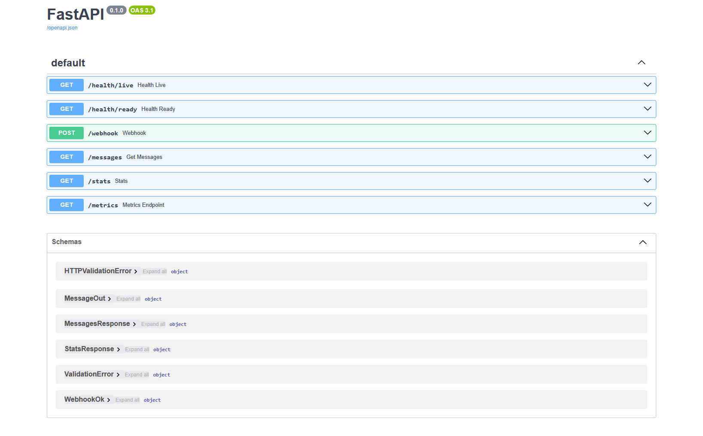

# Containerized Webhook API

## Setup Used

VSCode + Cursor + Windsurf 

## Project structure

```
/app
  main.py          # FastAPI app, middleware, routes
  models.py        # Pydantic models + validation
  storage.py       # SQLite schema + DB operations
  logging_utils.py # JSON logging helpers
  metrics.py       # Minimal Prometheus-style metrics
  config.py        # Environment config loading
/tests
  test_webhook.py
  test_messages.py
  test_stats.py
Dockerfile
docker-compose.yml
Makefile
requirements.txt
README.md
```

## Requirements

- Docker Desktop (recommended for evaluation / production-style run)
- Python (for local runs and signature helper snippets)

## Configuration (12-factor)

The service is configured only via environment variables:

- `WEBHOOK_SECRET` (required for readiness)
- `DATABASE_URL` (required)
- `LOG_LEVEL` (optional, default `INFO`)

Recommended `.env` for Docker:

```env
WEBHOOK_SECRET=testsecret
DATABASE_URL=sqlite:////data/app.db
LOG_LEVEL=INFO
```

Notes:

- `DATABASE_URL=sqlite:////data/app.db` is a Docker path (volume-mounted). For local runs, use `sqlite:///./local.db`.

## How to run (Docker Compose)

- Start: `make up`
- Logs: `make logs`
- Stop + remove volumes: `make down`

Service base URL:

- `http://localhost:8000`
- Swagger UI: `http://localhost:8000/docs`

### Health checks

- `GET /health/live` returns 200 when the app is running
- `GET /health/ready` returns:
  - 200 only if DB is reachable and schema is applied AND `WEBHOOK_SECRET` is set
  - 503 otherwise

## Environment variables

- DATABASE_URL
- WEBHOOK_SECRET
- LOG_LEVEL

Example:

DATABASE_URL=sqlite:////data/app.db
WEBHOOK_SECRET=testsecret
LOG_LEVEL=INFO

## Endpoints

- POST /webhook
- GET /messages
- GET /stats
- GET /metrics
- GET /health/live
- GET /health/ready

## How to hit endpoints (PowerShell examples)

### 1) POST /webhook

Request body example:

```json
{
  "message_id": "m1",
  "from": "+919876543210",
  "to": "+14155550100",
  "ts": "2025-01-15T10:00:00Z",
  "text": "Hello"
}
```

Signature header:

- Header: `X-Signature: <hex>`
- `hex = HMAC_SHA256(secret=WEBHOOK_SECRET, message=<raw request body bytes>)`

Create a JSON file (recommended to avoid Windows quoting issues):

```powershell
'{"message_id":"m1","from":"+919876543210","to":"+14155550100","ts":"2025-01-15T10:00:00Z","text":"Hello"}' |
  Out-File -NoNewline -Encoding utf8NoBOM body.json
```

Compute signature from the exact file bytes:

```powershell
$SIG = python -c "import hmac,hashlib; body=open('body.json','rb').read(); print(hmac.new(b'testsecret', body, hashlib.sha256).hexdigest())"
```

Invalid signature (expect 401):

```powershell
curl.exe -i `
  -H "Content-Type: application/json" `
  -H "X-Signature: 123" `
  --data-binary "@body.json" `
  http://localhost:8000/webhook
```

Valid signature (expect 200):

```powershell
curl.exe -i `
  -H "Content-Type: application/json" `
  -H "X-Signature: $SIG" `
  --data-binary "@body.json" `
  http://localhost:8000/webhook
```

Duplicate replay (same request again, expect 200 and no second insert):

```powershell
curl.exe -i `
  -H "Content-Type: application/json" `
  -H "X-Signature: $SIG" `
  --data-binary "@body.json" `
  http://localhost:8000/webhook
```

### 2) GET /messages

Query params:

- `limit` (default 50, min 1, max 100)
- `offset` (default 0, min 0)
- `from` (optional exact match on sender)
- `since` (optional ISO-8601 UTC timestamp with `Z` suffix)
- `q` (optional case-insensitive substring match on `text`)

Examples:

```powershell
curl.exe -s "http://localhost:8000/messages"
curl.exe -s "http://localhost:8000/messages?limit=2&offset=0"
curl.exe -s "http://localhost:8000/messages?from=+919876543210"
curl.exe -s "http://localhost:8000/messages?since=2025-01-15T09:30:00Z"
curl.exe -s "http://localhost:8000/messages?q=Hello"
```

Ordering is deterministic: `ORDER BY ts ASC, message_id ASC`.

### 3) GET /stats

```powershell
curl.exe -s "http://localhost:8000/stats"
```

Returns:

- `total_messages`
- `senders_count`
- `messages_per_sender` (top 10 senders by count desc)
- `first_message_ts` / `last_message_ts` (or null if no messages)

### 4) GET /metrics

```powershell
curl.exe -s "http://localhost:8000/metrics"
```

The evaluation checks that output includes at least:

- a line starting with `http_requests_total`
- a line starting with `webhook_requests_total`

## How to run locally (no Docker)

This is useful if you want to test visually in the browser / Postman.

1) Create `.env.local`:

```env
WEBHOOK_SECRET=testsecret
DATABASE_URL=sqlite:///./local.db
LOG_LEVEL=INFO
```

2) Install deps:

```sh
pip install -r requirements.txt
```

3) Run:

```sh
uvicorn app.main:app --reload --env-file .env.local --port 8001
```

Open:

- Swagger UI: `http://127.0.0.1:8001/docs`

Notes:

- If Docker is running on port 8000, use a different port for local runs (like 8001), or stop Docker first.

## Deploy on Render

This repo includes a `render.yaml` so you can deploy with Render's IaC blueprint.

### What gets provisioned

- A Python web service running FastAPI via Uvicorn
- A persistent disk mounted at `/data` (SQLite DB lives at `/data/app.db`)

### Render dashboard steps

1) Push this repo to GitHub.
2) In Render, go to:
 
    - **Dashboard**
    - **New**
    - **Blueprint**

3) Select your GitHub repo.
4) Render will detect `render.yaml`. Review and apply.

### Required environment variables (Render)

In Render, set:

- `WEBHOOK_SECRET` (required, non-empty)

The blueprint sets sensible defaults for:

- `DATABASE_URL=sqlite:////data/app.db`
- `LOG_LEVEL=INFO`

Notes:

- If `WEBHOOK_SECRET` is missing, `/health/ready` will return `503`.

### Verify after deploy

Use your Render service URL, then check:

- `GET /health/live` -> 200
- `GET /health/ready` -> 200
- Swagger UI -> `/docs`

Example:

- `https://<your-service>.onrender.com/health/ready`

### How Render runs the app

Render uses:

- Build command: `pip install -r requirements.txt`
- Start command: `uvicorn app.main:app --host 0.0.0.0 --port $PORT`

These are defined in `render.yaml`.

## Logging

Logs are one JSON object per line (good for `jq`), including:

- `ts` (ISO-8601)
- `level`
- `request_id` (also returned as `X-Request-Id` response header)
- `method`, `path`, `status`, `latency_ms`

For `/webhook`, logs also include:

- `message_id` (when present)
- `dup` (boolean)
- `result` (`created`, `duplicate`, `invalid_signature`, `validation_error`, ...)

## Design decisions

### HMAC verification

- Computes `HMAC_SHA256(WEBHOOK_SECRET, raw_request_body_bytes)`.
- Compares with `X-Signature` using constant-time compare.
- If signature is missing/invalid: returns 401 and does not write to DB.

### Exactly-once ingest / idempotency

- SQLite enforces uniqueness with `PRIMARY KEY (message_id)`.
- Duplicate inserts are handled gracefully (no stack traces) and still return `200 {"status":"ok"}`.

### Pagination contract

- Response includes:
  - `data`: page results
  - `total`: total rows matching filters (ignores `limit/offset`)
  - `limit`, `offset`: echoed back
- Ordering: `ts ASC, message_id ASC`.

### Stats

Uses SQL aggregation for:

- total rows
- distinct senders
- top senders (limit 10)
- min/max timestamps

### Metrics

Exposes a minimal Prometheus-style text endpoint at `/metrics`, including:

- http_requests_total{path=...,status=...}
- webhook_requests_total{result=...}
- request_latency_ms_bucket / request_latency_ms_count / request_latency_ms_sum
